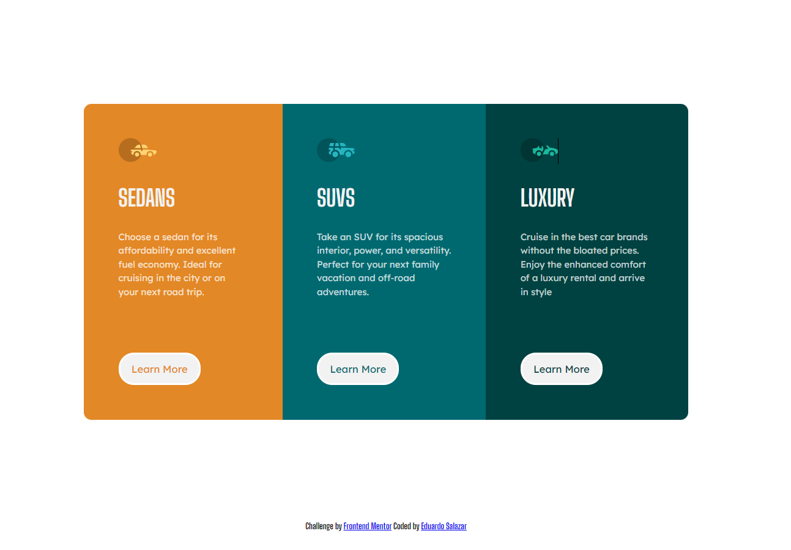

# Cartao3Colunas

Projeto desenvolvido para um desafio do Frontendmentor.

[Clique aqui para acessar](https://eu-salazar.github.io/Cartao3Colunas/)

## Notas:
 
 - O projeto possui algumas linhas de codigos que podem ter sido colocadas indevidamente ou entao de forma repetida, o que deixa o arquivo mais ´´sujo``.
 - Em um mes irei voltar aqui com mais conhecimento para aplicar nesse projeto e deixar o codigo mais otimizado.
 - O linha preta  no titulo Luxary nao é um bug (irei corrigir mais pra frente).

## Tecnologias:
  
 - HTML5
 - CSS3
  
